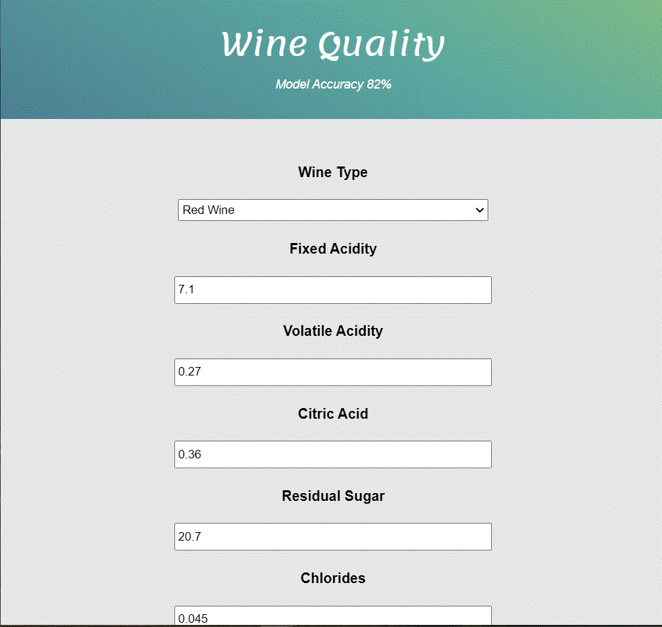
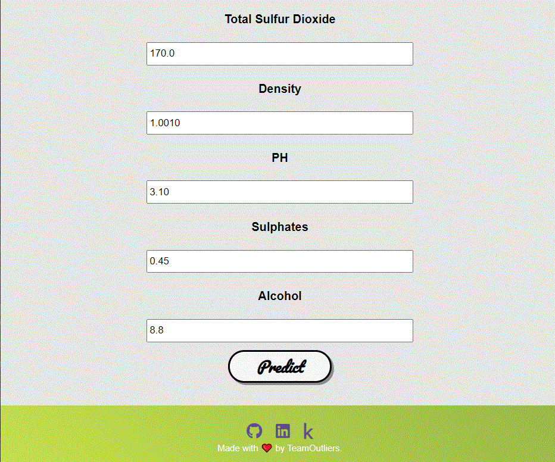
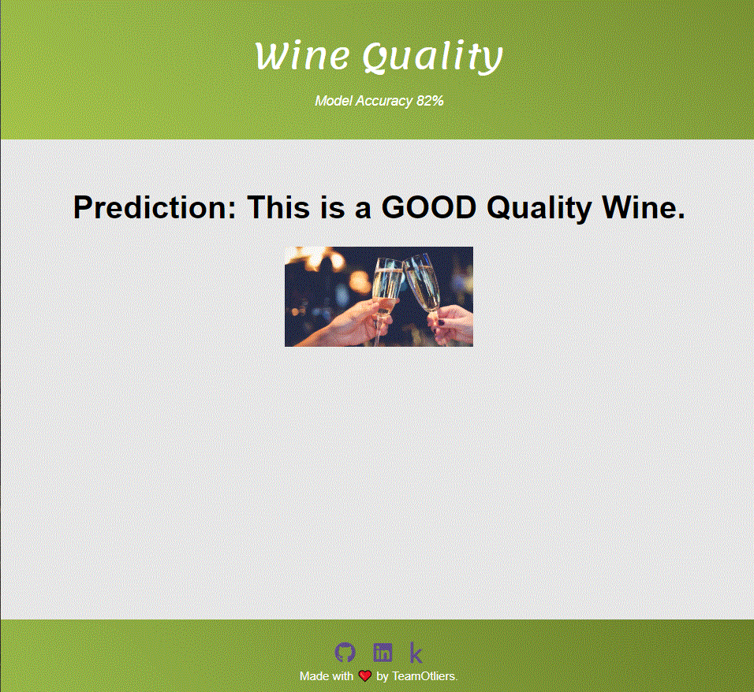

# Wine QUALITY - Deployed
  

• This repository consists of files required to deploy a __Machine Learning Web App_ created with _Flask_ on _Heroku__ platform.

• Dataset link: https://archive.ics.uci.edu/ml/datasets/Wine

• If you want to view the deployed model, click on the following link: 
Deployed at: https://wine-quality-pred.herokuapp.com/

• Please do ⭐ the repository, if you liked mine work :).

• A glimpse of the web app:

